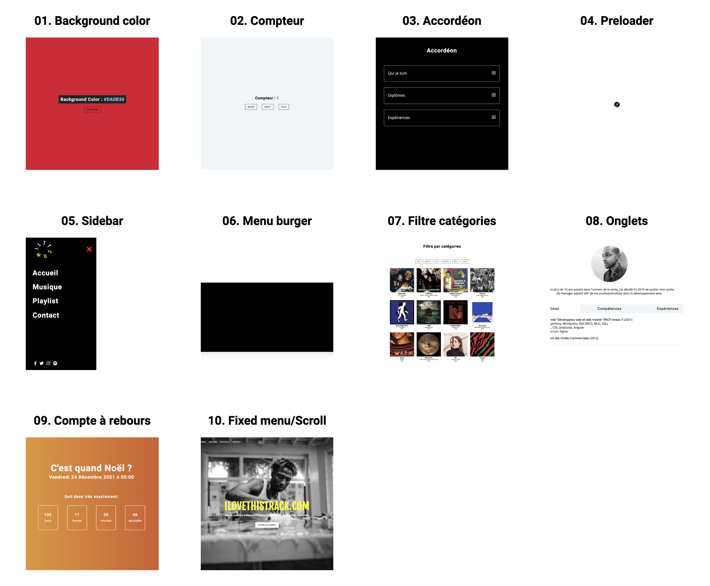

# Projets Javascript

Divers projets réalisés en JavaScript (Vanilla).

## 🚀 Installation

1. git clone ou télécharger le projet
2. ouvrir le fichier "index.html" situé à la racine

## 👀 Présentation des projets

1.  **Background color**: Modification aléatoire du background-color lorsqu'on clique sur un bouton

2.  **Compteur**: Incrémentation ou décrémentation de 1 en fonction du bouton cliqué. Modification de la couleur du total si supérieur, inférieur ou égal à 0. 3ème bouton permettant de réinitialiser à 0.

3.  **Accordéon**: Principe même de l'accordéon: on affiche un titre et lorsqu'on clique sur un bouton cela laisse apparaitre le texte associé au titre. Possibilité d'ouvrir et de fermer l'accordéon. Icône "+" lorsque l'accordéon est fermé, icône "-" lorsque celui est ouvert.

4.  **Preloader**: Création d'une homepage avec un background video - ce qui peut ralentir l'affichage du site. Pour éviter celà, mise en place d'un preloader (petit gif) qui disparait une fois que la page est entièrement chargée (via "window.onload").

5.  **Sidebar**: Mise en place d'une sidebar verticale. Possibilité d'ouvrir et/ou "cacher" la sidebar via 2 icônes.

6.  **Menu burger**: Création d'une navbar responsive avec logo, links et icônes réseaux sociaux. Lorsque la résolution est inférieure à 850px (sur mobile notamment), mise en place d'un bouton burger (icône) afin d'afficher ou cacher le menu.

7.  **Filtre catégories**: Affichage entièrement dynamique d'albums de musique (via un tableau d'objets) avec diverses données: artwork, catégorie, nom de l'artiste, date de sortie etc...). Possibilité de filtrer les albums par catégorie (filtre catégories créé également de façon dynamique via JavaScript). Création de plusieurs fonctions JavaScript et utilisation notamment de "DOMContentLoaded".

8.  **Onglets**: Mise en place de plusieurs onglets permettant d'afficher uniquement le contenu de l'onglet selectionné. Lorsqu'on clique sur un onglet son contenu s'affiche et ceux des autres est caché - pratique pour présenter différentes informations (ex: 1. Diplômes, 2. Compétences 3. Expériences) dans une seule et même "zone". Utilisation notamment de "dataset" en JavaScript.

9.  **Compte à rebours**: Création d'un compte à rebours (jours, heures, minutes et secondes restantes) avec comme date butoire vendredi 24 décembre 2021 à 00h00. Lorsque le compteur arrive à 0, celui ci est remplacé par un gif souhaitant Joyeux Noël. Ajout d'un bouton permettant de faire un bond dans le futur ainsi qu'affiché le gif. Utilisation de nombreuses fonctions et méthodes JavaScript pour obtenir le resultat souhaité ("getTime()", "getFullYear/Month/Day/hours...()", "Math.floor()", "clearInterval()", "setInterval()", ".innerHTML" etc...).

10.  **Menu fixe + Scroll vers le haut**: Création d'un site avec diverses fonctionnalités: barre de navigation (menu) transparent lorsque la page charge. Le menu devient fixe (et avec un background-color) lorsqu'on commence à scroller vers le bas; Menu burger lorsque la résolution passe en dessous de 800px de définition (avec calcul cette fois ci dynamique de la height nécessaire). Mise en place d'un bouton permettant de remonter en haut de page (apparaition du bouton lorsque le scroll dépasse les 1000px). Implémentation d'encres et du smooth scroll pour naviguer entre les différentes sections du site. Utilisation de plusieurs fonctions et méthodes JavaScript ("getBoundingClientRect", "window.pageYOffset", "preventDefault", "classList.contains", ".offsetTop" etc...).

